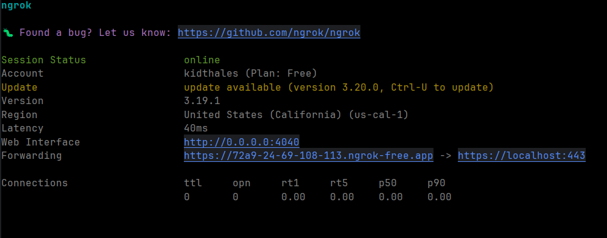

# Forwarding Traffic to Localhost

When developing on localhost, we often want to make our app available to public traffic (i.e. receive Discord webhooks & interactions).

## Using Ngrok

1. Go to https://ngrok.com/ and create a free account.
2. Go to the dashboard and [retrieve a copy of your auth token](https://dashboard.ngrok.com/get-started/your-authtoken).
3. Using the auth token, start the forwarding agent to our app running on localhost: `docker run -it --rm --net=host -e NGROK_AUTHTOKEN=<token> ngrok/ngrok http https://localhost:443 --host-header=localhost`

You may use the published forwarding url (`https://xxxx-xx-xx-xxx-xxx.ngrok-free.app`) when registering app endpoints with Discord, accessing the app dashboard, etc.
